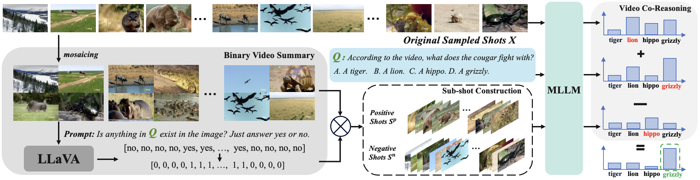

<p align="center">
    
</p>


## CoS: Chain-of-Shot Prompting for Long Video Understanding
<p align="center">
    🌐 <a href="https://lwpyh.github.io/CoS/" target="_blank">Website</a> | 📃 <a href="https://arxiv.org/pdf/2502.06428" target="_blank">Paper</a> 

</p>

<p align="center">
    <a href="https://lwpyh.github.io/">Jian Hu</a>,&nbsp;&nbsp;
    <a href="https://zxccade.github.io/">Zixu Cheng</a>,&nbsp;&nbsp;
    <a href="https://chenyangsi.top/">Chenyang Si</a>,&nbsp;&nbsp;
    <a href="https://weivision.github.io/">Wei Li</a>,&nbsp;&nbsp;
    <a href="http://www.eecs.qmul.ac.uk/~sgg/">Shaogang Gong</a>
</p>

    
✨ **Highlights**:

(i) We are the first to approach long video understanding by optimising input video information to fully utilise the model’s ability to comprehend long videos.

(ii) We propose a training-free mosaicing binary coding together with pseudo temporal grounding for long video understanding.

(iii) We apply our CoS into three various baseline to demonstrate its effectiveness and adaptability.


## Installation 
```bash
conda create -n CoS python=3.10 -y && conda activate cos
pip install torch==2.1.2 torchvision --index-url https://download.pytorch.org/whl/cu118
pip install packaging &&  pip install ninja && pip install flash-attn --no-build-isolation --no-cache-dir
pip install -r requirements.txt
cd LongVA/
python -m pip install -e "longva/.[train]"
pip install transformers==4.46.3
pip install -q bitsandbytes==0.42.0 accelerate==0.26.0
cd lmms-eval
pip install -e .
```

## Long Video Benchmark Evaluation
For **Video-MME**, **LongVideoBench**, **MLVU** evaluation, please use  [`lmms-eval`](https://github.com/EvolvingLMMs-Lab/lmms-eval) After installing `lmms-eval` and CoS, you can use the following script to evaluate. note now our baseline is LongVA, you can extend our CoS to any baselines by modifying codes in lmms-eval folders.

```bash
accelerate launch --num_processes 8 --main_process_port 12345 -m lmms_eval \
    --model longva_cos \
    --model_args pretrained=lmms-lab/LongVA-7B,conv_template=qwen_1_5,model_name=llava_qwen,max_frames_num=128,video_decode_backend=decord\
    --tasks videomme \
    --batch_size 1 \
    --log_samples \
    --log_samples_suffix videoxl \
    --output_path ./logs/
```

## Citation
If you find this repository useful, please consider giving a star :star: and citation

```
@article{hu2025cos,
  title={CoS: Chain-of-Shot Prompting for Long Video Understanding},
  author={Hu, Jian and Cheng, Zixu and Si, Chenyang and Li, Wei and Gong, Shaogang},
  journal={arXiv preprint arXiv:2502.06428},
  year={2025}
}
```

## Acknowledgement
- LongVA: the codebase we built upon. 
- LMMs-Eval: the codebase we built for CoS and evaluation.
- Special thanks to Shu Yan for his generous and selfless help.

## License
This project utilizes certain datasets and checkpoints that are subject to their respective original licenses. Users must comply with all terms and conditions of these original licenses.
The content of this project itself is licensed under the [Apache license 2.0](./LICENSE).


